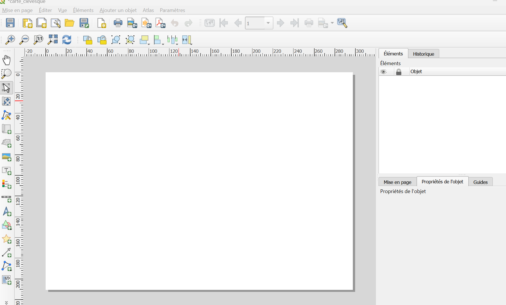
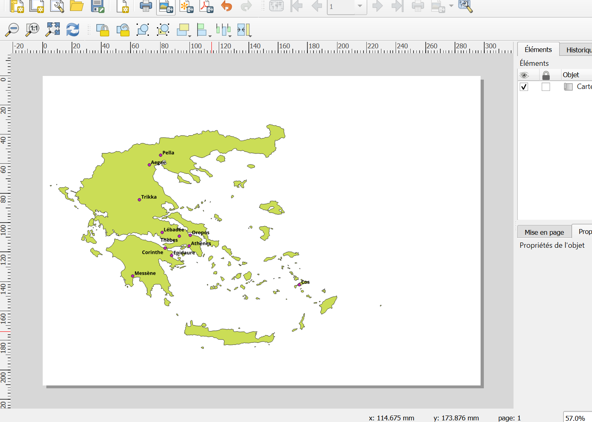
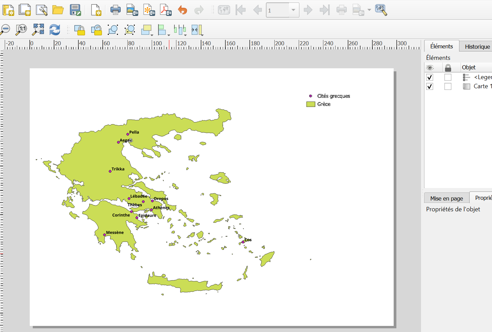
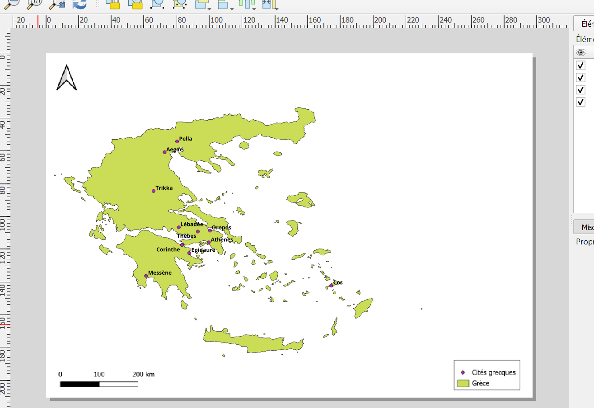
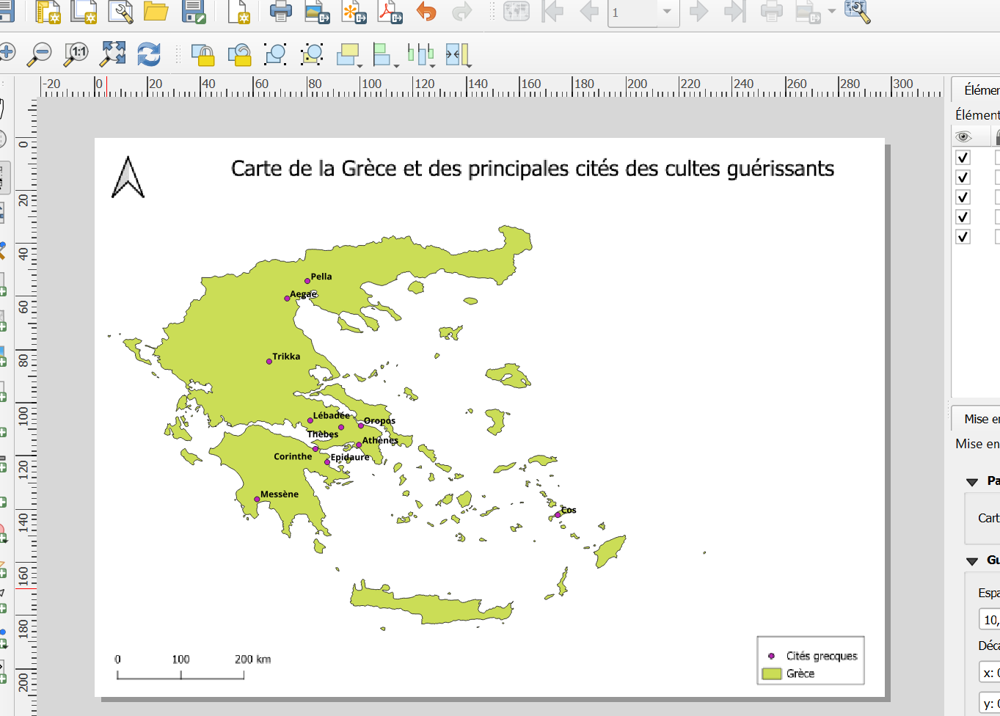
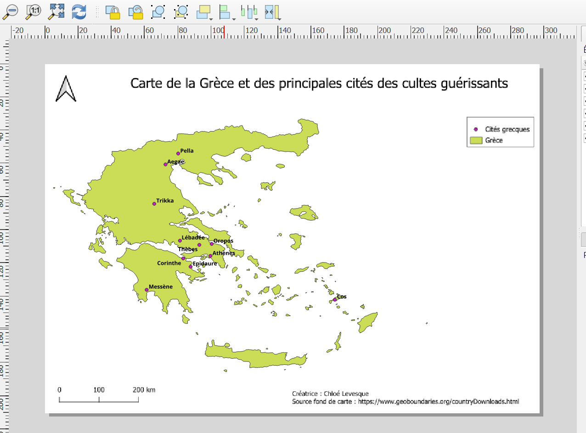

# Carte de la Grèce ancienne et des principales cités des cultes guérissants

A ce stade de ma réflexion, le titre de mon mémoire est : "Les rêves. Entre réalité et illusion dans les croyances grecques antiques". Il était donc difficile pour moi de faire une carte sur ce sujet, puisqu'à priori, tout le monde rêve. 

J'ai tout de même pris la décision de prendre un fond de carte de la Grèce et d'y faire figurer les principales cités où l'on pratique un culte des divinités guérissantes. En effet, l'incubation est une pratique ancienne qui consiste à dormir dans un temple pour guérir par les rêves, c'est donc un pan important de mon sujet. 

Je n'ai malheureusement pas réussi à trouver de fond de carte de la Grèce antique ; la Turquie actuelle ou l'Anatolie de l'époque n'apparaît donc pas. C'est un problème parce que Pergame qui se situe en Turquie actuelle, est aussi un grand centre d'incubation dédié à Asclépios.  

J'ai trouvé mon fond de carte sur le site https://www.geoboundaries.org/countryDownloads.html. 

J'ai utilisé du vert pour la Grèce et du rose pour les cités, parce que cela rendait bien.

Et voilà le résultat final : 

Faire cette carte m'a permis d'y voir un peu plus clair, car il est difficile de placer mon sujet dans l'espace. Ainsi, j'ai pu rédiger un cadre spatio-temporel dans l'introduction de mon pré-mémoire. 